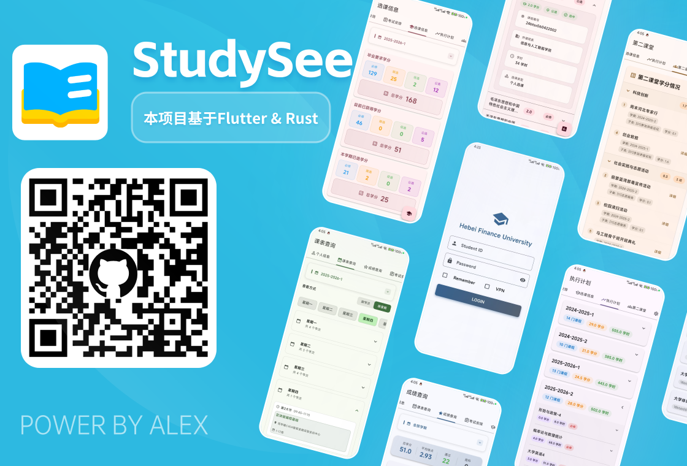
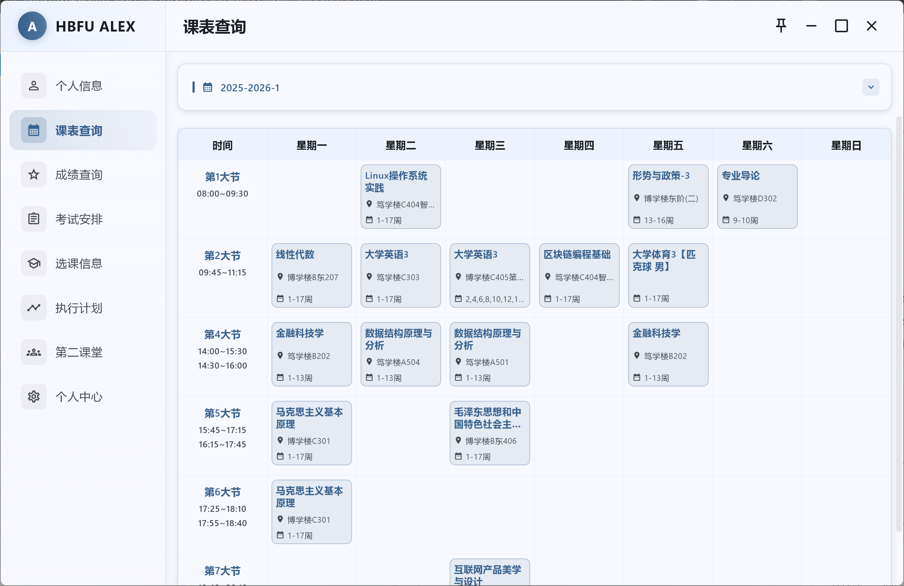

# 📚 StudySee

基于 **Flutter + Rust** 的河北金融学院教务系统轻量查询工具。

- **💻 平台**：Android / Windows
- **🛠 技术栈**：Flutter（Dart）+ Rust + flutter_rust_bridge

## ✨ 功能

- 🗓 课表、考试、成绩查询、选课查询、第二课堂 ...
- 👤 个人/学籍信息查看




## 🚀 安装

### 📥 下载发布版

前往 \[Releases] 下载对应平台安装包：

- 📱 Android：APK
- 🖥 Windows：安装包

### 🔧 源码构建

1. 安装 Flutter 3.x+、Rust stable、Android 构建环境
2. 克隆仓库：

```bash
git clone https://github.com/1IANZ/StudySee.git
cd StudySee
```

3. 安装依赖并生成桥接代码：

```bash
flutter pub get

flutter_rust_bridge_codegen generate
```

4. 运行：

```bash
flutter run -d android  # 📱 Android
flutter run -d windows  # 🖥 Windows
```

## 📂 目录

```
lib/      # Flutter 代码
rust/     # Rust 核心逻辑
android/  # Android 工程
windows/  # Windows 工程
```

## 📜 声明

- 本项目仅用于学习交流，请勿用于违规用途。
- License: MIT
